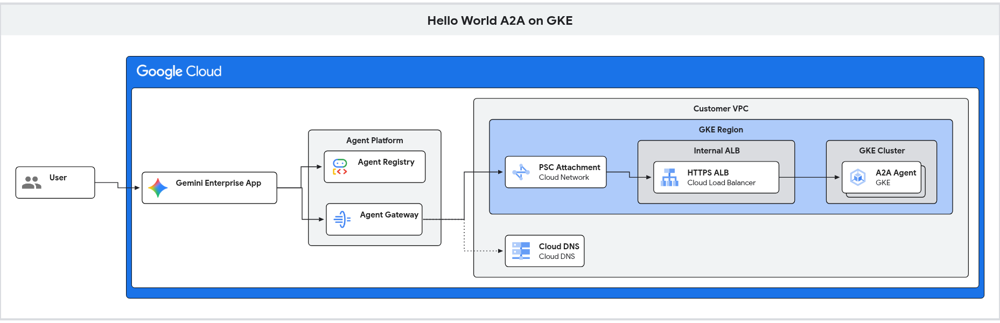
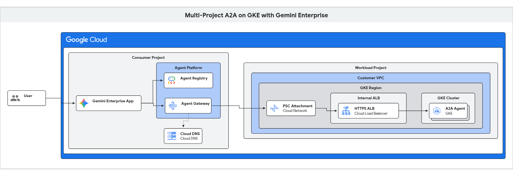

# Secure Agent-to-Agent (A2A) on GKE for Gemini Enterprise

A production-ready reference implementation demonstrating how to deploy, govern, and expose secure **Agent-to-Agent (A2A)** microservices on **Google Kubernetes Engine (GKE)** to **Gemini Enterprise (Discovery Engine)** applications.

This solution integrates **GKE Autopilot**, **Regional Internal Application Load Balancers (ALBs)** with Standalone Network Endpoint Groups (NEGs), **Google Certificate Manager**, and **Agent Gateway (Egress Gateway)** across both single-project and multi-project enterprise architectures.

---

## 🏛️ High-Level Architecture Overview

This repository supports two architectural topologies depending on your organization's landing zone model:

### 1. Single-Project Architecture (Development & Prototyping)
All infrastructure components—GKE cluster, VPC network, Regional Internal ALB, Certificate Manager, Agent Gateway, Agent Registry, and Gemini Enterprise—reside within a single Google Cloud project.



👉 *For the detailed technical flowchart, component specifications, and step-by-step single-project runbook, see the [Single-Project Architecture Guide](docs/architecture/single-project.md).*

---

### 2. Multi-Project Architecture (Enterprise Production Landing Zone)
Separates the **Workload Project** (GKE cluster, VPC, Regional Internal ALB, TLS certificates, and Private Service Connect Network Attachment) from the **Consumer Project** (Gemini Enterprise App, Agent Gateway, Agent Registry, and Cloud DNS).



👉 *For the detailed technical flowchart, cross-project PSC security model, and step-by-step multi-project runbook, see the [Multi-Project Architecture Guide](docs/architecture/multi-project.md).*

---

## ⚖️ Architectural Decision Matrix: Single-Project vs. Multi-Project

| Architectural Dimension | Single-Project Topology | Multi-Project Topology |
| :--- | :--- | :--- |
| **Recommended Use Case** | Fast prototyping, sandbox development, self-contained demos | Enterprise production, centralized AI platforms, multi-tenant organizations |
| **Workload Hosting** | Project A (`your-project-id`) | Project A (`your-workload-project-id`) |
| **AI Platform / Gemini Enterprise** | Project A (`your-project-id`) | Project B (`your-consumer-project-id`) |
| **Agent Gateway Location** | Project A (attached to local VPC) | Project B (attached to Project A via cross-project PSC) |
| **Network Boundary** | Shared local VPC | Cross-project PSC interface with `ACCEPT_MANUAL` producer whitelisting |
| **IAM Trust Boundary** | Internal project service agents | Scoped cross-project `roles/compute.networkUser` grants |
| **Terraform Configuration** | `deployment/terraform/single-project` | `deployment/terraform/multi-project` (dual aliased providers) |
| **Registration Workflow** | Automated script (`scripts/register_single_project.sh`) | Automated script (`scripts/register_multi_project.sh`) |

---

## 🏛️ Key Technical Pillars

1. **Modular Infrastructure via Terraform**:
   Decomposed into 9 decoupled modules (`foundation`, `networking`, `gke`, `k8s-app`, `certificates`, `dns`, `internal-lb`, `agent-gateway`, `observability`) following the Google Cloud Networking reference architecture.
2. **GKE Autopilot & Standalone NEGs**:
   The agent container runs on GKE Autopilot. Kubernetes Services utilize Standalone Network Endpoint Groups (`cloud.google.com/neg`) allowing the Regional Internal ALB to route traffic directly to container Pod IPs across active zones without kube-proxy hops.
3. **Regional Co-Location with PSC Network Attachment**:
   Dynamic Private Service Connect interfaces (PSC-I / Network Attachments) used by Google Agent Gateway require the consumer Gateway, Network Attachment, and target Regional Internal Application Load Balancer to reside within the **same Google Cloud region** (e.g. `us-central1`). Cross-region egress from PSC-I dynamic interfaces to a regional ILB in another region is dropped at the data plane.
4. **Declarative Google Certificate Manager**:
   Google Agent Gateway validates TLS certificates against trusted public CAs. Regional Google-managed certificates are provisioned via Certificate Manager with automated DNS-01 authorizations in Cloud DNS directly in Terraform.
5. **Agent Gateway & DNS Architecture**:
   The Agent Gateway uses a Private Service Connect (PSC) network attachment for VPC egress and resolves public DNS records natively through Google's public resolver while routing payloads through private VPC interfaces.
6. **Agent Registry & Discovery Engine**:
   The A2A endpoint is cataloged in Agent Registry and linked to Gemini Enterprise (`importedAgent`), enabling native conversational invocation.

---

## 📂 Repository Layout

```
.
├── app/                                    # A2A Agent application source code (FastAPI, ADK, JSON-RPC)
├── deployment/
│   ├── terraform/
│   │   ├── modules/                        # Decoupled Terraform infrastructure modules
│   │   │   ├── foundation/                 # APIs, Service Accounts, Base IAM
│   │   │   ├── networking/                 # VPC, Subnets, Cloud NAT, PSC Network Attachment
│   │   │   ├── gke/                        # GKE Autopilot Cluster, Artifact Registry
│   │   │   ├── k8s-app/                    # Kubernetes Service, Deployment, HPA, PDB
│   │   │   ├── certificates/               # Google Certificate Manager Regional Certs
│   │   │   ├── dns/                        # Cloud DNS challenge & ALB A records
│   │   │   ├── internal-lb/                # Regional Internal ALB, URL Map, Standalone NEGs
│   │   │   ├── agent-gateway/              # Egress Agent Gateway, IAP Authz Extension & Policy
│   │   │   └── observability/              # BigQuery telemetry dataset, Logging sinks
│   │   ├── single-project/                 # Single-project root Terraform configuration
│   │   └── multi-project/                  # Multi-project root Terraform configuration (dual providers)
├── docs/
│   ├── architecture/
│   │   ├── single-project.md               # Detailed single-project flowchart & operational runbook
│   │   └── multi-project.md                # Detailed multi-project flowchart & operational runbook
│   ├── adr/                                # Architectural Decision Records (0001, 0002, 0003)
│   └── production-security-guide.md        # Hardening guide (Active IAP, Model Armor, VPC-SC)
├── scripts/
│   ├── register_multi_project.sh           # Automated multi-project registration in Agent Registry & GE
│   └── validate_multi_project.sh           # End-to-end multi-project health checks & StreamAssist verification
└── tests/                                  # Unit and integration test suites
```

---

## ⚡ Quickstart

### Option A: Deploy Single-Project Stack
For local sandboxes and self-contained testing within a single GCP project:

```bash
# 1. Provision Infrastructure
cd deployment/terraform/single-project
terraform init && terraform apply -auto-approve

# 2. Build & Deploy Container Image
cd ../../..
IMAGE_URI="us-central1-docker.pkg.dev/${PROJECT_ID}/hello-world-a2a/hello-world-a2a:v1"
gcloud builds submit --project="${PROJECT_ID}" --tag "${IMAGE_URI}" .

# 3. Follow Full Deployment & Registration Runbook
```
👉 *Read the full [Single-Project Architecture & Deployment Guide](docs/architecture/single-project.md).*

---

### Option B: Deploy Multi-Project Stack
For enterprise architectures separating workload hosting from Gemini Enterprise:

```bash
# 1. Provision Multi-Project Infrastructure (Workload + Consumer Projects)
cd deployment/terraform/multi-project
terraform init && terraform apply -auto-approve

# 2. Build & Deploy Container Image to Workload Project
cd ../../..
IMAGE_URI="us-central1-docker.pkg.dev/${WORKLOAD_PROJECT_ID}/hello-world-a2a/hello-world-a2a:v1"
gcloud builds submit --project="${WORKLOAD_PROJECT_ID}" --tag "${IMAGE_URI}" .

# 3. Register Service across Projects
./scripts/register_multi_project.sh

# 4. Run End-to-End Validation
./scripts/validate_multi_project.sh
```
👉 *Read the full [Multi-Project Architecture & Deployment Guide](docs/architecture/multi-project.md).*

---

## 📚 Documentation & Reference Guides

- 📖 **[Single-Project Architecture Guide](docs/architecture/single-project.md)**: Deep-dive flowchart, packet flow sequence, and single-project runbook.
- 📖 **[Multi-Project Architecture Guide](docs/architecture/multi-project.md)**: Deep-dive flowchart, cross-project PSC security model, and multi-project runbook.
- 🛡️ **[Production Security & Authorization Guide](docs/production-security-guide.md)**: Enforcing active IAP, Model Armor content filtering, mTLS, and VPC Service Controls.
- 📐 **Architectural Decision Records (ADRs)**:
  - [ADR 0001: Modular Terraform & Certificate Manager](docs/adr/0001-modular-terraform-and-certificate-manager.md)
  - [ADR 0002: Internal ALB & Dynamic Multi-Zone NEGs](docs/adr/0002-internal-alb-and-dns-design.md)
  - [ADR 0003: Multi-Project Agent Gateway Architecture](docs/adr/0003-multi-project-agent-gateway.md)

---

## 📄 License

Copyright 2026 Google LLC. Licensed under the Apache License, Version 2.0.
