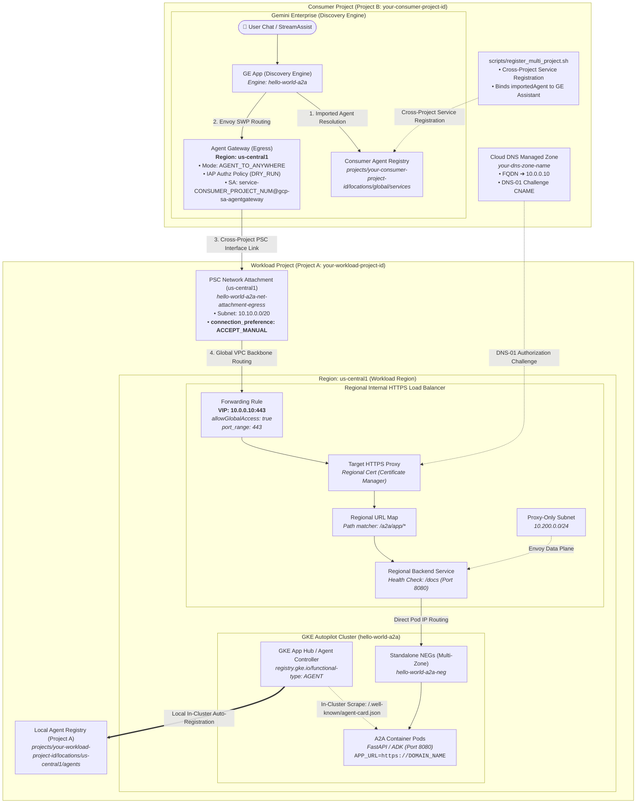

# Multi-Project Architecture & Deployment Guide

This document provides the complete architectural design, network flowcharts, cross-project trust models, and operational runbook for deploying the **Agent-to-Agent (A2A)** GKE architecture across a **multi-project enterprise landing zone**:
- **Workload Project (Project A - `your-workload-project-id`)**: Hosts the GKE Autopilot cluster, Standalone NEGs, Regional Internal ALB, Certificate Manager TLS certificates, and PSC Network Attachment.
- **Consumer Project (Project B - `your-consumer-project-id`)**: Hosts the Gemini Enterprise Discovery Engine App, Agent Gateway, Agent Registry catalog, and Cloud DNS managed zone (`your-dns-zone-name`).

---

## 🏛️ Multi-Project Architecture Overview

Separating workload infrastructure from AI consumption is standard in enterprise organizations:
- **Workload Project Team**: Manages container workloads, microservice deployments, VPC routing, and private load balancers.
- **AI Platform / Consumer Team**: Manages Gemini Enterprise assistants, Agent Gateways, access governance, and fleet-wide Agent Registries.

### High-Level Visual


---

## 📊 Detailed Technical Flowchart



---

## 🔒 Cross-Project Trust & Security Model

The multi-project design establishes a zero-trust cross-project boundary:

1. **Explicit PSC Whitelisting (`ACCEPT_MANUAL`)**:
   - The PSC Network Attachment in Project A does not accept arbitrary connections. It enforces `connection_preference = "ACCEPT_MANUAL"` with `producer_accept_lists = ["your-consumer-project-id"]`.
2. **Scoped IAM Network User Role**:
   - Project A grants `roles/compute.networkUser` on the network attachment subnet strictly to Consumer Project B's Agent Gateway Service Agent:
     `service-CONSUMER_PROJECT_NUM@gcp-sa-agentgateway.iam.gserviceaccount.com`.
3. **Consumer Discovery Engine Permissions**:
   - In Project B, Discovery Engine Service Agent (`service-CONSUMER_PROJECT_NUM@gcp-sa-discoveryengine.iam.gserviceaccount.com`) is granted the custom role `agent_gateway_ge_access` to query the local Agent Gateway and Agent Registry.
4. **Governed Egress & Authorization Extensions**:
   - All outgoing requests from Gemini Enterprise are intercepted by Project B's Agent Gateway and evaluated against IAP / Model Armor authorization policies before entering Project A's VPC.
5. **Cross-Project Ingestion Boundary vs. Local Auto-Registration**:
   - GKE In-Cluster Agent Auto-Registration operates within the scope of the project hosting the cluster (Workload Project A). The GKE runtime controller automatically indexes the workload and discovers skills into Project A's local regional Agent Registry (`projects/your-workload-project-id/locations/us-central1/agents`).
   - Because the in-cluster controller cannot cross GCP organizational/project IAM boundaries to publish into Consumer Project B, `scripts/register_multi_project.sh` bridges the cross-project gap. It registers the service endpoint (`https://${DOMAIN_NAME}/a2a/app`) into Project B's Agent Registry and binds it to Project B's Discovery Engine Assistant.

---

## 📋 Prerequisites

1. **Two Google Cloud Projects**:
   - Workload Project: `your-workload-project-id` (Project Number: `your-workload-project-num`)
   - Consumer Project: `your-consumer-project-id` (Project Number: `your-consumer-project-num`)
2. **IAM Privileges**: Project Owner or Network Admin and Security Admin on both projects.
3. **Active Gemini Enterprise App** in Consumer Project B (`your-consumer-project-id`).
4. **Cloud DNS Managed Zone** in Consumer Project B (`your-dns-zone-name`).

---

## ⚙️ Environment Configuration

For multi-project deployments, initialize your local `.env` from the provided multi-project template:

```bash
cp .env.multi-project.example .env
```

### Environment Variables Breakdown

| Variable | Requirement | Default | Description |
| :--- | :--- | :--- | :--- |
| `WORKLOAD_PROJECT_ID` | **Required** | — | Project A hosting GKE cluster, VPC, ALB, Certs, and PSC Network Attachment |
| `CONSUMER_PROJECT_ID` | **Required** | — | Project B hosting Discovery Engine App, Agent Gateway, and Catalog |
| `CONSUMER_PROJECT_NUM` | **Required** | — | Numeric Project Number for Project B (required for Discovery Engine REST APIs) |
| `DOMAIN_NAME` | **Required** | — | Fully qualified domain name pointing to Regional Internal ALB VIP |
| `DNS_ZONE_NAME` | **Required** | — | Cloud DNS managed zone name (for ALB `A` record and DNS-01 ACME challenge) |
| `ENGINE_ID` | **Required** | — | Discovery Engine App / Engine ID in Consumer Project B |
| `DNS_PROJECT_ID` | Optional | `CONSUMER_PROJECT_ID` | Project hosting Cloud DNS zone (defaults to Project B) |
| `GKE_REGION` | Optional | `us-central1` | Workload and ALB region in Project A (must match `GATEWAY_REGION`) |
| `GATEWAY_REGION` | Optional | `us-central1` | Gateway region in Project B (must match `GKE_REGION` for PSC data plane) |
| `GATEWAY_NAME` | Optional | `hello-world-a2a-egress-gateway` | Egress Agent Gateway resource name in Project B |
| `ALB_INTERNAL_IP` | Optional | `10.0.0.6` | Reserved private RFC 1918 VIP assigned to ALB in Project A |
| `PROJECT_NAME` | Optional | `hello-world-a2a` | Common resource prefix for cluster, certs, and NEGs |
| `IMAGE_TAG` | Optional | `v1` | Container image version tag |

### Example `.env` File

```bash
# --- REQUIRED ---
WORKLOAD_PROJECT_ID="your-workload-project-id"
CONSUMER_PROJECT_ID="your-consumer-project-id"
CONSUMER_PROJECT_NUM="your-consumer-project-num"
DOMAIN_NAME="hello-world-a2a.yourdomain.com"
DNS_ZONE_NAME="your-dns-zone-name"
ENGINE_ID="your-gemini-enterprise-app-id"

# --- OPTIONAL / DEFAULTS ---
DNS_PROJECT_ID="your-consumer-project-id"
GKE_REGION="us-central1"
GATEWAY_REGION="us-central1"
GATEWAY_NAME="hello-world-a2a-egress-gateway"
ALB_INTERNAL_IP="10.0.0.6"
PROJECT_NAME="hello-world-a2a"
IMAGE_TAG="v1"
```

Export variables into your active shell session:

```bash
set -a && source .env && set +a
```

---

## 🚀 Step-by-Step Deployment Runbook

### Step 1: Provision Multi-Project Infrastructure with Terraform

The multi-project Terraform configuration (`deployment/terraform/multi-project`) uses dual aliased Google Cloud providers (`google.workload` and `google.consumer`) to orchestrate both projects simultaneously:

1. Navigate to the multi-project directory:
   ```bash
   cd deployment/terraform/multi-project
   ```

2. Review `terraform.tfvars`:
   ```hcl
   workload_project_id   = "your-workload-project-id"
   consumer_project_id   = "your-consumer-project-id"
   dns_project_id        = "your-consumer-project-id"
   project_name          = "hello-world-a2a"
   region                = "us-central1"
   egress_gateway_region = "us-central1"
   domain_name           = "hello-world-a2a.yourdomain.com"
   dns_zone_name         = "your-dns-zone-name"
   enable_create_dns_zone = false
   enable_agent_gateway  = true
   enable_observability  = true
   enable_k8s_workload   = true
   iap_enforcement_mode  = "DRY_RUN"
   fail_open             = true
   ```

3. Initialize and apply:
   ```bash
   export GOOGLE_OAUTH_ACCESS_TOKEN="$(gcloud auth print-access-token)"
   terraform init
   terraform apply -auto-approve
   ```

---

### Step 2: Build & Deploy Container to GKE in Workload Project

1. Build and push the container image to Artifact Registry in `your-workload-project-id`:
   ```bash
   cd ../../..
   IMAGE_URI="${GKE_REGION}-docker.pkg.dev/${WORKLOAD_PROJECT_ID}/${PROJECT_NAME}/${PROJECT_NAME}:${IMAGE_TAG}"
   gcloud builds submit --project="${WORKLOAD_PROJECT_ID}" --tag "${IMAGE_URI}" .
   ```

2. Update the GKE deployment image:
   ```bash
   ENDPOINT="$(gcloud container clusters describe ${PROJECT_NAME} --region="${GKE_REGION}" --project="${WORKLOAD_PROJECT_ID}" --format='value(endpoint)')"
   TOKEN="$(gcloud auth print-access-token)"

   kubectl --token="${TOKEN}" --server="https://${ENDPOINT}" --insecure-skip-tls-verify \
     set image deployment/${PROJECT_NAME} ${PROJECT_NAME}="${IMAGE_URI}" -n ${PROJECT_NAME}

   kubectl --token="${TOKEN}" --server="https://${ENDPOINT}" --insecure-skip-tls-verify \
     rollout status deployment/${PROJECT_NAME} -n ${PROJECT_NAME} --timeout=180s
   ```

---

### Step 3: Register Agent across Projects into Gemini Enterprise

In the multi-project topology:
- **Workload Project A**: The GKE controller automatically discovers the workload via `registry.gke.io/functional-type: "AGENT"` and registers it into Project A's local regional Agent Registry (`projects/${WORKLOAD_PROJECT_ID}/locations/${GKE_REGION}/agents/...`).
- **Consumer Project B**: To bridge the organizational boundary and make the agent accessible to Gemini Enterprise in Consumer Project B, execute the cross-project registration script:

```bash
./scripts/register_multi_project.sh
```

This automated script:
1. Creates or updates the Service in **Agent Registry** in Consumer Project B (`your-consumer-project-id`).
2. Patches the Discovery Engine Engine in Project B to point `defaultEgressAgentGateway` to Project B's Agent Gateway.
3. Generates the A2A Agent Card JSON referencing `https://${DOMAIN_NAME}/a2a/app`.
4. Imports the agent into the Discovery Engine Assistant (`default_assistant`).

---

## 🔍 Validation & Verification Protocol

Execute the automated health check and verification script:

```bash
./scripts/validate_multi_project.sh
```

### Manual Verification Commands

#### 1. Check GKE Regional ALB Health (Workload Project)
```bash
gcloud compute backend-services get-health hello-world-a2a-backend-service \
  --region=us-central1 \
  --project=your-workload-project-id
```
*Expected*: Health state is `HEALTHY` across active zonal pod endpoints.

#### 2. Check PSC Network Attachment Status (Workload Project)
```bash
gcloud compute network-attachments describe hello-world-a2a-net-attachment-egress \
  --region=us-central1 \
  --project=your-workload-project-id
```
*Expected*: `connectionPreference: ACCEPT_MANUAL`, `producerAcceptLists: [your-consumer-project-id]`.

#### 3. Check Agent Gateway Egress Link (Consumer Project)
```bash
gcloud network-services agent-gateways describe hello-world-a2a-egress-gateway \
  --location=us-central1 \
  --project=your-consumer-project-id
```
*Expected*: `networkAttachment` references `projects/your-workload-project-id/regions/us-central1/networkAttachments/hello-world-a2a-net-attachment-egress`.

#### 4. Test StreamAssist API (Consumer Project ➔ Workload GKE)
```bash
DISCOVERY_ENGINE_AGENT_ID=$(curl -s -X GET \
  -H "Authorization: Bearer $(gcloud auth print-access-token)" \
  -H "X-Goog-User-Project: your-consumer-project-id" \
  "https://discoveryengine.googleapis.com/v1alpha/projects/your-consumer-project-num/locations/global/collections/default_collection/engines/hello-world-a2a/assistants/default_assistant/agents" \
  | jq -r '.agents[] | select(.displayName=="Hello World GKE Multi-Project" or .displayName=="Hello World GKE") | .name | split("/")[-1]' | head -n 1)

curl -N -X POST \
  -H "Authorization: Bearer $(gcloud auth print-access-token)" \
  -H "X-Goog-User-Project: your-consumer-project-id" \
  -H "Content-Type: application/json" \
  "https://discoveryengine.googleapis.com/v1alpha/projects/your-consumer-project-num/locations/global/collections/default_collection/engines/hello-world-a2a/assistants/default_assistant:streamAssist" \
  -d '{
    "query": { "text": "Hello Bob! Please say hello back from GKE." },
    "answerGenerationMode": "AGENT",
    "agentsSpec": {
      "agentSpecs": [{ "agentId": "'"${DISCOVERY_ENGINE_AGENT_ID}"'" }],
      "mentionMode": "DIRECT"
    }
  }'
```

---

## 🛠️ Multi-Project Cleanup

To destroy all multi-project resources cleanly:

```bash
cd deployment/terraform/multi-project
export GOOGLE_OAUTH_ACCESS_TOKEN="$(gcloud auth print-access-token)"
terraform destroy -auto-approve
```

---

## 🧠 Architectural Insights & Lessons Learned

### 1. Cross-Project PSC Network Attachment Regional Co-Location
- **The Rule**: The Egress Agent Gateway in Consumer Project B and the PSC Network Attachment & Regional Internal ALB in Workload Project A **must reside within the same Google Cloud region** (`us-central1`).
- **The Data Plane Constraint**: PSC Network Attachment dynamic interfaces do not route across regions to a Regional Internal ALB in another region. Cross-region attempts fail with `HTTP 504: upstream request timeout`.

### 2. Cross-Project Agent Ingestion Demarcation
- **The Boundary**: GKE in-cluster auto-registration discovers and registers workloads strictly within the local GCP project (`your-workload-project-id`).
- **The Federation Model**: Workload teams retain full local cataloging and live skill inspection within their own project (`projects/your-workload-project-id/locations/us-central1/agents`), while the centralized AI Platform team governs consumer-side access and agent import in Consumer Project B via declarative cross-project registration (`scripts/register_multi_project.sh`).

### 3. Public Domain Routing over Private PSC Link
- **The Pattern**: The public domain name configured in Cloud DNS maps to the private RFC 1918 ALB VIP (`10.0.0.10`). The Agent Gateway resolves the domain using Google's public DNS infrastructure while transmitting the actual encrypted request payloads through the private cross-project PSC dynamic interface.
