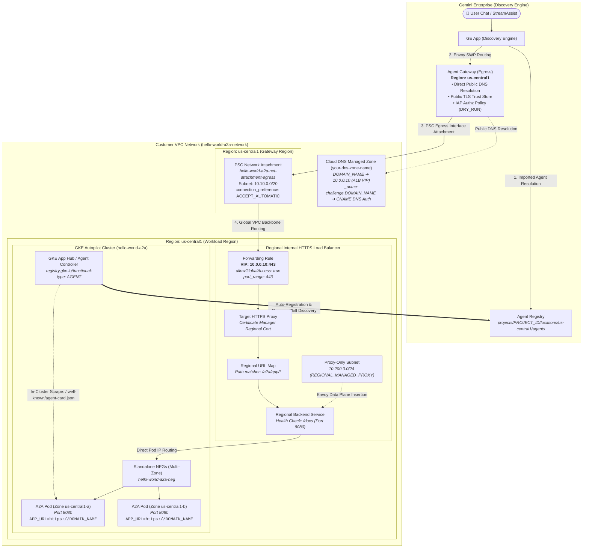

# Single-Project Architecture & Deployment Guide

This document provides the in-depth architectural design, network flowcharts, component specifications, and complete operational runbook for deploying the **Agent-to-Agent (A2A)** service on **Google Kubernetes Engine (GKE)** within a **single Google Cloud project**.

---

## 🏛️ Architecture Overview

In a single-project deployment, all foundational resources—including the GKE cluster, VPC network, Regional Internal Application Load Balancer, Certificate Manager regional certificates, Egress Agent Gateway, Agent Registry, and Gemini Enterprise application—reside inside the same GCP project boundary.

### High-Level Visual


---

## 📊 Detailed Technical Flowchart



---

## 🔍 Request Traversal Sequence

0. **In-Cluster Agent Auto-Registration**: Upon Pod deployment, the GKE cluster runtime controller detects the `registry.gke.io/functional-type: "AGENT"` label and `a2a-protocol.org/agent-card` annotation. It scrapes `/.well-known/agent-card.json` on port 8080 directly from the pod and dynamically registers the agent with its live skills in Google Cloud Agent Registry (`projects/<PROJECT_ID>/locations/<GKE_REGION>/agents/<AGENT_ID>`).
1. **User Invocation**: A licensed user sends a chat message or calls the Discovery Engine `StreamAssist` API targeting the assistant.
2. **Imported Agent Lookup**: The Discovery Engine Assistant resolves the agent binding via **Agent Registry** (`importedAgent.agent`), loading the A2A agent card metadata and target URL (`https://<DOMAIN_NAME>/a2a/app`).
3. **Egress Gateway Routing**: Discovery Engine matches the domain against the configured `defaultEgressAgentGateway` in `us-central1`. The Agent Gateway resolves `<DOMAIN_NAME>` via public DNS to `10.0.0.10`.
4. **IAP Policy Evaluation**: The Agent Gateway evaluates the attached `REQUEST_AUTHZ` authorization policy and IAP Service Extension (`DRY_RUN` mode), forwarding the request over its PSC network attachment interface.
5. **VPC Backbone Routing**: Packets enter the VPC via the PSC Network Attachment subnet (`10.10.0.0/20`) in `us-central1` and route directly to the Regional Internal ALB (co-located in `us-central1` to ensure PSC Network Attachment data-plane compatibility).
6. **Load Balancing & TLS Termination**: The Regional Internal ALB receives traffic on its private forwarding rule VIP (`10.0.0.10:443`). Because `allow_global_access = true` is enabled, internal VPC routing is preserved. The Target HTTPS Proxy terminates TLS using Google Certificate Manager.
7. **Direct Container Pod Routing**: Regional Envoy proxies in the proxy-only subnet (`10.200.0.0/24`) forward the HTTP/JSON-RPC request directly to the GKE Autopilot Pod IP addresses mapped by the Standalone Network Endpoint Group (`hello-world-a2a-neg`), bypassing kube-proxy.
8. **A2A Processing & Streaming Response**: The FastAPI container processes the request, executes agent skills, and streams SSE/JSON-RPC response chunks back through the reverse path to the user.

---

## 📋 Prerequisites

- A **Gemini Enterprise (Discovery Engine) App** with active user licensing and the testing user added to the application.
- **Google Cloud SDK (`gcloud`)** installed and authenticated (`gcloud auth login`).
- **Terraform (`>= 1.0.0`)** installed.
- **kubectl** and **Docker** or **Cloud Build** access.
- A **Cloud DNS Managed Zone** for domain verification (e.g., `<DOMAIN_NAME>` in `<DNS_ZONE_NAME>`).
- **IAM Roles**: Project Owner or Network Admin, Security Admin, Discovery Engine Admin, and Agent Registry Admin.

---

## ⚙️ Environment Configuration Reference

Create `.env` in the repository root:

```bash
PROJECT_ID="your-project-id"                                   # GCP Project ID
PROJECT_NUM="your-project-number"                               # GCP Project Number
GKE_REGION="us-central1"                                        # Workload region (GKE and ALB)
GATEWAY_REGION="us-central1"                                   # Egress gateway region
GATEWAY_NAME="hello-world-a2a-egress-gateway"                  # Agent Gateway name
DOMAIN_NAME="hello-world-a2a.yourdomain.com"                   # Fully qualified domain name
DNS_ZONE_NAME="your-dns-zone-name"                             # Cloud DNS zone name
DNS_PROJECT_ID="your-dns-project-id"                           # Project hosting Cloud DNS zone
ALB_INTERNAL_IP="10.0.0.10"                                    # Reserved private VIP for ALB
ENGINE_ID="your-gemini-enterprise-app-id"                      # Discovery Engine App/Engine ID
PROJECT_NAME="hello-world-a2a"                                 # Resource naming prefix
IMAGE_TAG="v1"                                                 # Container image tag
```

Load the variables into your shell session:

```bash
set -a && source .env && set +a
```

---

## 🚀 Step-by-Step Deployment Runbook

### Step 1: Provision Infrastructure with Modular Terraform

1. Navigate to the single-project Terraform directory:
   ```bash
   cd deployment/terraform/single-project
   ```

2. Create `terraform.tfvars`:
   ```hcl
   project_id            = "your-project-id"
   project_name          = "hello-world-a2a"
   region                = "us-central1"
   egress_gateway_region = "us-central1"
   domain_name           = "hello-world-a2a.yourdomain.com"
   dns_zone_name         = "your-dns-zone-name"
   dns_project_id        = "your-dns-project-id"
   ```

3. Initialize and apply:
   ```bash
   export GOOGLE_OAUTH_ACCESS_TOKEN="$(gcloud auth print-access-token)"
   terraform init
   terraform apply -auto-approve
   ```

This deploys 9 modular phases:
- **`foundation`**: Enables all Google APIs and grants Compute Service Account Cloud Build rights.
- **`networking`**: VPC, GKE Subnet, Regional Proxy-Only Subnet, Egress Subnet, PSC NAT Subnet, Cloud NAT, Cloud Router, and Firewall rules.
- **`gke`**: GKE Autopilot cluster, Artifact Registry, and Workload Identity Service Account bindings.
- **`k8s-app`**: Kubernetes Namespace, KSA, Service (Standalone NEG), Deployment, HPA, and PDB.
- **`certificates`**: Google Certificate Manager Regional Certificate and DNS-01 Authorization.
- **`dns`**: Automatically inserts the DNS challenge record and ALB `A` record into Cloud DNS.
- **`internal-lb`**: Regional Internal ALB (Health Check, Dynamic NEG Backend, URL Map, HTTPS Proxy, and Forwarding Rule with `allow_global_access = true`).
- **`agent-gateway`**: Agent Gateway (`AGENT_TO_ANYWHERE`), PSC Egress link, IAP Authz Extension (`DRY_RUN`), and Authz Policy.
- **`observability`**: BigQuery telemetry dataset, logging sinks, and completions external table/view.

---

### Step 2: Build and Deploy Container to GKE

1. Build and push the container image using Cloud Build:
   ```bash
   cd ../../..
   IMAGE_URI="${GKE_REGION}-docker.pkg.dev/${PROJECT_ID}/${PROJECT_NAME}/${PROJECT_NAME}:${IMAGE_TAG}"
   gcloud builds submit --project="${PROJECT_ID}" --tag "${IMAGE_URI}" .
   ```

2. Connect to the GKE Cluster and update the Deployment image:
   ```bash
   ENDPOINT="$(gcloud container clusters describe ${PROJECT_NAME} --region="${GKE_REGION}" --project="${PROJECT_ID}" --format='value(endpoint)')"
   TOKEN="$(gcloud auth print-access-token)"

   kubectl --token="${TOKEN}" --server="https://${ENDPOINT}" --insecure-skip-tls-verify \
     set image deployment/${PROJECT_NAME} ${PROJECT_NAME}="${IMAGE_URI}" -n ${PROJECT_NAME}

   kubectl --token="${TOKEN}" --server="https://${ENDPOINT}" --insecure-skip-tls-verify \
     rollout status deployment/${PROJECT_NAME} -n ${PROJECT_NAME} --timeout=180s
   ```

3. Verify Pod and Standalone NEG status:
   ```bash
   kubectl --token="${TOKEN}" --server="https://${ENDPOINT}" --insecure-skip-tls-verify \
     get pods -n ${PROJECT_NAME}

   gcloud compute backend-services get-health "${PROJECT_NAME}-backend-service" \
     --region="${GKE_REGION}" --project="${PROJECT_ID}"
   ```

---

### Step 3: Register Agent into Gemini Enterprise

In single-project deployments, the GKE cluster runtime controller automatically discovers the workload via `registry.gke.io/functional-type: "AGENT"` and queries `a2a-protocol.org/agent-card` to index the live agent skills directly into **Agent Registry** (`projects/${PROJECT_ID}/locations/global/agents/...`).

Execute the automated single-project registration script to bind the auto-registered agent to Gemini Enterprise:

#### Automated Registration (Recommended)

```bash
./scripts/register_single_project.sh
```

This automated script:
1. Detects and queries the auto-registered **`Agent`** in **Agent Registry** (with bounded polling for controller reconciliation), or falls back to explicit `Service` registration if needed.
2. Patches the Discovery Engine Engine in `${PROJECT_ID}` to point `defaultEgressAgentGateway` to the Agent Gateway.
3. Imports the agent into the Discovery Engine Assistant (`default_assistant`) referencing the Agent Registry URN.

---

#### Manual Registration Alternative

##### Option 1: Bind the Auto-Registered GKE Agent (Recommended)

When using GKE auto-registration, the cluster controller automatically registers the agent in the cluster's region (`${GKE_REGION}`).

1. Retrieve the auto-registered Agent Resource URN:
   ```bash
   AGENT_REGISTRY_URN=$(gcloud alpha agent-registry agents list \
     --location="${GKE_REGION}" \
     --project="${PROJECT_ID}" \
     --format="value(name)" | head -n 1)
   echo "Auto-Registered Agent URN: ${AGENT_REGISTRY_URN}"
   ```

2. (Optional) Inspect the live skills discovered by GKE:
   ```bash
   gcloud alpha agent-registry agents describe "${AGENT_REGISTRY_URN}" \
     --location="${GKE_REGION}" \
     --project="${PROJECT_ID}"
   ```

3. Configure Discovery Engine to route through Agent Gateway and import the agent:
   ```bash
   # Configure Agent Gateway on Discovery Engine
   curl -s -X PATCH \
     -H "Authorization: Bearer $(gcloud auth print-access-token)" \
     -H "X-Goog-User-Project: ${PROJECT_ID}" \
     -H "Content-Type: application/json" \
     "https://discoveryengine.googleapis.com/v1alpha/projects/${PROJECT_NUM}/locations/global/collections/default_collection/engines/${ENGINE_ID}?updateMask=agentGatewaySetting" \
     -d '{
       "agentGatewaySetting": {
         "defaultEgressAgentGateway": {
           "name": "projects/'"${PROJECT_ID}"'/locations/'"${GATEWAY_REGION}"'/agentGateways/'"${GATEWAY_NAME}"'"
         }
       }
     }'

   # Import the Auto-Registered Agent into the Assistant
   curl -s -X POST \
     -H "Authorization: Bearer $(gcloud auth print-access-token)" \
     -H "X-Goog-User-Project: ${PROJECT_ID}" \
     -H "Content-Type: application/json" \
     "https://discoveryengine.googleapis.com/v1alpha/projects/${PROJECT_NUM}/locations/global/collections/default_collection/engines/${ENGINE_ID}/assistants/default_assistant/agents" \
     -d '{
       "displayName": "Hello World GKE",
       "description": "Greets users and provides personalized greetings via GKE and Agent Gateway",
       "importedAgent": {
         "agent": "'"${AGENT_REGISTRY_URN}"'"
       }
     }'
   ```

---

##### Option 2: Explicit Service Registration Fallback

If GKE auto-registration is disabled or cluster controller reconciliation has not yet completed:

1. Register the Service in Agent Registry:
   ```bash
   gcloud alpha agent-registry services create "${PROJECT_NAME}" \
     --location="${GKE_REGION}" \
     --display-name="Hello World A2A Service" \
     --description="GKE Hosted A2A Service" \
     --agent-spec-type=no-spec \
     --interfaces="url=https://${DOMAIN_NAME}/a2a/app,protocolBinding=jsonrpc" \
     --project="${PROJECT_ID}"
   ```

2. Retrieve the generated Agent Registry Resource URN:
   ```bash
   AGENT_REGISTRY_URN=$(gcloud alpha agent-registry services describe "${PROJECT_NAME}" \
     --location="${GKE_REGION}" \
     --project="${PROJECT_ID}" \
     --format="value(registryResource)")
   echo "Agent Registry URN: ${AGENT_REGISTRY_URN}"
   ```

3. Import the Service into Discovery Engine with an explicit Agent Card:
   ```bash
   cat << 'EOF' > /tmp/agent_card.json
   {
     "capabilities": {
       "extensions": [
         {
           "description": "Ability to use the new agent executor implementation",
           "uri": "https://google.github.io/adk-docs/a2a/a2a-extension/"
         }
       ],
       "streaming": true
     },
     "defaultInputModes": ["text/plain"],
     "defaultOutputModes": ["text/plain"],
     "description": "Greets users and provides personalized greetings via GKE and Agent Gateway",
     "name": "hello_world_a2a_agent",
     "preferredTransport": "JSONRPC",
     "protocolVersion": "0.3.0",
     "skills": [
       {
         "description": "An LLM-based agent",
         "id": "root_agent",
         "name": "model",
         "tags": ["llm"]
       },
       {
         "description": "Provides a friendly hello world greeting.",
         "id": "root_agent-say_hello",
         "name": "say_hello",
         "tags": ["llm", "tools"]
       }
     ],
     "supportsAuthenticatedExtendedCard": false,
     "url": "https://DOMAIN_PLACEHOLDER/a2a/app",
     "version": "0.1.0"
   }
   EOF

   sed -i "s/DOMAIN_PLACEHOLDER/${DOMAIN_NAME}/g" /tmp/agent_card.json

   curl -s -X POST \
     -H "Authorization: Bearer $(gcloud auth print-access-token)" \
     -H "X-Goog-User-Project: ${PROJECT_ID}" \
     -H "Content-Type: application/json" \
     "https://discoveryengine.googleapis.com/v1alpha/projects/${PROJECT_NUM}/locations/global/collections/default_collection/engines/${ENGINE_ID}/assistants/default_assistant/agents" \
     -d '{
       "displayName": "Hello World GKE",
       "description": "Greets users and provides personalized greetings via GKE and Agent Gateway",
       "importedAgent": {
         "agent": "'"${AGENT_REGISTRY_URN}"'"
       },
       "a2aAgentDefinition": {
         "jsonAgentCard": "'"$(cat /tmp/agent_card.json | jq -c . | jq -R . | sed 's/^"//; s/"$//')"' "
       }
     }'
   ```

---

## 🔍 Verification & Testing

### Automated Health Check & Verification (Recommended)

Execute the automated health check and verification script:

```bash
./scripts/validate_single_project.sh
```

This automated script runs a comprehensive 5-point verification:
1. **ALB & Backend Service Health**: Validates regional backend service health states, Certificate Manager managed certificates, and PSC Network Attachment status.
2. **Agent Gateway**: Verifies the regional Agent Gateway configuration in `${PROJECT_ID}`.
3. **Agent Registry**: Verifies that the service interface is correctly registered and bound.
4. **Agent Resolution**: Resolves the Discovery Engine Assistant Agent ID.
5. **End-to-End Test (`StreamAssist`)**: Dispatches a live test prompt through Gemini Enterprise Discovery Engine to the GKE A2A container.

---

### Manual Verification Commands

#### Option A: Programmatic API Verification (`StreamAssist`)

1. Retrieve the Discovery Engine Agent ID:
   ```bash
   DISCOVERY_ENGINE_AGENT_ID=$(curl -s -X GET \
     -H "Authorization: Bearer $(gcloud auth print-access-token)" \
     -H "X-Goog-User-Project: ${PROJECT_ID}" \
     "https://discoveryengine.googleapis.com/v1alpha/projects/${PROJECT_NUM}/locations/global/collections/default_collection/engines/${ENGINE_ID}/assistants/default_assistant/agents" \
     | jq -r '.agents[] | select(.displayName=="Hello World GKE") | .name | split("/")[-1]')
   echo "Discovery Engine Agent ID: ${DISCOVERY_ENGINE_AGENT_ID}"
   ```

2. Send a test StreamAssist invocation:
   ```bash
   curl -N -X POST \
     -H "Authorization: Bearer $(gcloud auth print-access-token)" \
     -H "X-Goog-User-Project: ${PROJECT_ID}" \
     -H "Content-Type: application/json" \
     "https://discoveryengine.googleapis.com/v1alpha/projects/${PROJECT_NUM}/locations/global/collections/default_collection/engines/${ENGINE_ID}/assistants/default_assistant:streamAssist" \
     -d '{
       "query": {
         "text": "Hello Bob! Please say hello back from GKE."
       },
       "answerGenerationMode": "AGENT",
       "agentsSpec": {
         "agentSpecs": [
           {
             "agentId": "'"${DISCOVERY_ENGINE_AGENT_ID}"'"
           }
         ],
         "mentionMode": "DIRECT"
       }
     }'
   ```

### Option B: Gemini Enterprise Web UI

1. Open your **Gemini Enterprise App** in the browser.
2. Select the **`Hello World GKE`** agent from the agent dropdown.
3. Send a test prompt: `Hello Bob! Please say hello back from GKE.`
4. Verify the streaming greeting returned from the GKE Pod via Agent Gateway.

---

## 🛠️ Useful Log Queries

```bash
# 1. Agent Gateway Requests and Security Policy Evaluation Logs
gcloud logging read 'resource.type="networkservices.googleapis.com/Gateway"' \
  --project="${PROJECT_ID}" --limit=10 --format=json

# 2. StreamAssist Invocation Logs (Gemini Enterprise Activity)
gcloud logging read 'jsonPayload.logMetadata.methodName="StreamAssist"' \
  --project="${PROJECT_ID}" --limit=5 --format=json

# 3. Discovery Engine Error Logs
gcloud logging read 'logName:"discoveryengine" AND severity>=ERROR' \
  --project="${PROJECT_ID}" --limit=10 --format=json

# 4. Load Balancer Backend Health Status
gcloud compute backend-services get-health hello-world-a2a-backend-service \
  --region="${GKE_REGION}" --project="${PROJECT_ID}"
```

---

## 🧹 Clean Up & Teardown

To destroy all single-project resources cleanly:

```bash
cd deployment/terraform/single-project
terraform destroy -auto-approve
```

---

## 🧠 Architectural Insights & Lessons Learned

### 1. Regional Co-Location for PSC Network Attachment Compatibility
- **The Issue**: When the Agent Gateway connects to the VPC via a Private Service Connect Network Attachment, egress traffic to a Regional Internal ALB must reside within the **same Google Cloud region** (e.g. `us-central1`). Cross-region egress from PSC dynamic interfaces to a regional ILB in another region is dropped at the data plane, resulting in `HTTP 504: upstream request timeout`.
- **The Mechanism**: Dynamic Private Service Connect interfaces (PSC-I) establish dynamic NICs within the consumer/attachment subnet. In Google Cloud networking, traffic entering a PSC dynamic interface cannot cross regional boundaries to reach a Regional Internal Application Load Balancer in another region.
- **The Solution**: Co-locate the GKE cluster, Regional Internal ALB, and Egress Agent Gateway within the same region (`us-central1`). Additionally, ensure the Forwarding Rule retains `allow_global_access = true` for VPC routing consistency.

### 2. Public DNS Resolution vs. Private DNS Peering
- **The Issue**: Specifying `dnsPeeringConfig.domains` on an Agent Gateway fails when using a publicly registered domain with `Config validation failed: domain does not exist as a private zone`.
- **The Mechanism**: `dnsPeeringConfig` is exclusively for private Cloud DNS zones associated directly with the VPC.
- **The Lesson**: When the domain is publicly registered in Cloud DNS (even if its `A` record points to an RFC 1918 internal VIP), omit `dns_peering_config`. The Agent Gateway resolves public DNS names natively through Google's public resolver while routing the payload through the VPC network attachment.

### 3. GKE Autopilot Zonal Standalone NEG Dynamic Provisioning
- **The Issue**: In GKE Autopilot, Standalone NEGs are only created in zones where Pods are actively scheduled (e.g. `us-central1-a`, `us-central1-b`). Attempting to bind the Backend Service to nonexistent zonal NEGs causes `404 Not Found` errors during cluster boot.
- **The Solution**: In `modules/internal-lb`, the backend service dynamically defaults to the primary active zone (or an explicit `neg_zones` list) to avoid referencing nonexistent zonal NEGs during initial cluster boot.

### 4. Forwarding Rule Target HTTPS Proxy Port Specification
- **The Issue**: For `INTERNAL_MANAGED` forwarding rules targeting a `TargetHttpsProxy`, specifying `ports = ["443"]` fails with `Invalid target type TARGET_HTTPS_PROXY for forwarding rule with IPProtocol TCP with no port specified`.
- **The Solution**: Use `port_range = "443"` instead of `ports = [...]` on the `google_compute_forwarding_rule` resource.

### 5. Agent Gateway Default-Deny Posture
- **The Issue**: Egress Agent Gateways (`AGENT_TO_ANYWHERE`) enforce a default-deny posture. Requests fail with `HTTP Error 403: Access denied` (`matchedRules: [{"action": "DENIED", "name": "default_denied"}]`) unless an authorization policy is attached.
- **The Solution**: `modules/agent-gateway` attaches an IAP Request Authorization Extension in `DRY_RUN` mode (`fail_open = true`, `iamEnforcementMode: "DRY_RUN"`), allowing connectivity while logging evaluations until production enforcement is enabled.

### 6. GKE In-Cluster Agent Auto-Registration & Dynamic Skill Discovery
- **The Mechanism**: The GKE cluster runtime controller watches Kubernetes workloads. When a deployment is labeled with `registry.gke.io/functional-type: "AGENT"` and annotated with `a2a-protocol.org/agent-card`, the controller automatically queries the Pod locally on port 8080 at the specified endpoint (`/.well-known/agent-card.json`). It ingests the returned agent specification and registers it as an `Agent` in Google Cloud Agent Registry in the cluster's region (`projects/${PROJECT_ID}/locations/${GKE_REGION}/agents/...`).
- **The `APP_URL` Environment Invariant**: By default, local agents might advertise `localhost:8080` or internal pod IPs in their agent cards. When Gemini Enterprise calls the agent via Agent Gateway, it requires an externally resolvable HTTPS domain. Injecting `APP_URL = "https://${var.domain_name}"` into the container environment ensures the introspected agent card advertises `https://${DOMAIN_NAME}/a2a/app` as its public URL.
- **Elimination of Skill Drift**: Whenever developers add, update, or remove tools or skills in `app/agent.py`, redeploying the container updates the introspected card automatically. The GKE controller syncs these changes to Agent Registry without requiring manual CLI registration scripts or schema patching.
