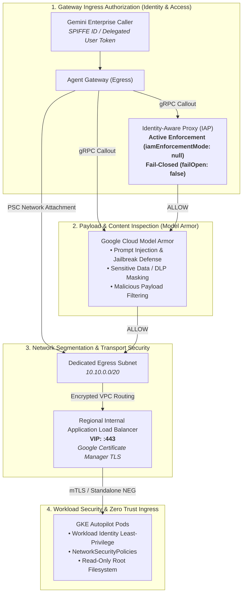

# Production Security & Authorization Hardening Guide

This guide details the end-to-end security architecture, IAM configurations, content protection policies, and operational runbooks required to transition the **A2A on GKE & Gemini Enterprise integration** from development into an enterprise **Zero Trust Production environment**.

---

## 🏛️ Zero Trust Defense-in-Depth Architecture



---

## 📋 Security Hardening Phases

### Phase 1: Identity & Access Control (IAP Active Enforcement)

In development, the Agent Gateway uses `iamEnforcementMode: "DRY_RUN"` and `failOpen: true` to avoid blocking connectivity while logging policy evaluations. In production, this must be switched to **Active IAM Enforcement** and **Fail-Closed**.

#### 1. Update Terraform Configuration

In `deployment/terraform/single-project/terraform.tfvars`:

```hcl
# Transition from DRY_RUN to active enforcement
iap_enforcement_mode = null

# Enforce fail-closed posture (reject requests if authz service is unreachable)
fail_open            = false
```

When `iap_enforcement_mode` is set to `null`, the `google_network_services_authz_extension` resource in `modules/agent-gateway` removes the `iamEnforcementMode: "DRY_RUN"` metadata attribute, causing IAP to enforce access policies strictly.

#### 2. Configure Caller IAM Permissions

Agent Gateway evaluates the caller's authenticated identity. Grant the required IAM accessor roles:

```bash
# Grant access to authorized corporate user groups
gcloud projects add-iam-policy-binding "${PROJECT_ID}" \
  --member="group:authorized-agent-users@yourdomain.com" \
  --role="roles/iap.httpsResourceAccessor"

# Grant access to the Gemini Enterprise Assistant SPIFFE service identity
gcloud projects add-iam-policy-binding "${PROJECT_ID}" \
  --member="serviceAccount:service-${PROJECT_NUM}@gcp-sa-discoveryengine.iam.gserviceaccount.com" \
  --role="roles/agentregistry.client"
```

---

### Phase 2: Pre-Cutover Verification & Cloud Logging

Before switching off `DRY_RUN`, inspect Cloud Audit Logs to confirm that all legitimate application traffic is evaluated as `ALLOW`.

#### Query Authorization Decisions in Cloud Logging

```bash
gcloud logging read \
  'resource.type="networkservices.googleapis.com/Gateway" AND jsonPayload.@type="type.googleapis.com/google.cloud.networkservices.v1.AuthzPolicyLog"' \
  --project="${PROJECT_ID}" \
  --limit=25 \
  --format="table(timestamp, jsonPayload.action, jsonPayload.principal, jsonPayload.destination.address)"
```

**Expected Result**: All legitimate requests should report `action: "ALLOW"`. If any traffic shows `action: "DENIED"`, verify the corresponding IAM role bindings before proceeding with active enforcement.

---

### Phase 3: Content Protection with Model Armor

To protect against prompt injection, data exfiltration, and malicious tool manipulation, attach a Google Cloud **Model Armor** service extension to the Agent Gateway.

#### 1. Define Model Armor Floor Setting / Template

```bash
# Create a Model Armor filter template for prompt injection and DLP
gcloud alpha model-armor templates create "production-agent-filter" \
  --location="${GATEWAY_REGION}" \
  --project="${PROJECT_ID}" \
  --filter-config='{"piiFilterConfig": {"mode": "BLOCK"}, "promptInjectionFilterConfig": {"mode": "BLOCK"}}'
```

#### 2. Terraform Resource Definition for Model Armor Extension

Add the Model Armor extension and policy profile to `deployment/terraform/modules/agent-gateway/main.tf`:

```hcl
# Model Armor Service Extension
resource "google_network_services_authz_extension" "model_armor" {
  provider  = google-beta
  project   = var.project_id
  name      = "${var.gateway_name}-model-armor-ext"
  location  = var.gateway_region
  service   = "modelarmor.googleapis.com"
  timeout   = "5s"
  fail_open = false

  metadata = {
    modelArmorTemplate = "projects/${var.project_id}/locations/${var.gateway_region}/templates/production-agent-filter"
  }
}

# Content Authorization Policy on Agent Gateway
resource "google_network_security_authz_policy" "model_armor" {
  provider       = google-beta
  project        = var.project_id
  name           = "${var.gateway_name}-content-policy"
  location       = var.gateway_region
  policy_profile = "CONTENT_AUTHZ"
  action         = "CUSTOM"

  target {
    resources = [google_network_services_agent_gateway.this.id]
  }

  custom_provider {
    authz_extension {
      resources = [google_network_services_authz_extension.model_armor.id]
    }
  }
}
```

---

### Phase 4: Network & Workload Hardening

#### 1. Mutual TLS (mTLS) to GKE Pods
- Configure the Regional Target HTTPS Proxy and Backend Service in `modules/internal-lb` with a `ServerTlsPolicy` and `ClientTlsPolicy`.
- Terminate mTLS at the pod level using an Envoy sidecar or Cilium/GKE Service Mesh, ensuring end-to-end cryptographic service attestation.

#### 2. VPC Service Controls (VPC-SC) Perimeter
Place the project inside a Service Perimeter:
- Include services: `discoveryengine.googleapis.com`, `agentregistry.googleapis.com`, `networkservices.googleapis.com`, `container.googleapis.com`.
- Protect the VPC Network Attachment and internal IPs from data exfiltration across organizational boundaries.

#### 3. Kubernetes Least-Privilege & Runtime Security
- **Workload Identity**: Ensure the Kubernetes ServiceAccount is bound only to the minimal required IAM roles (`app_sa_roles` in Terraform).
- **Network Policies**: Restrict egress traffic from the `hello-world-a2a` namespace so pods can only communicate with required Google APIs via Private Google Access.
- **Read-Only Root Filesystem**: Configure the Pod security context to drop all capabilities and enforce `readOnlyRootFilesystem: true`.

---

## 🚨 Operational Runbook & Emergency Rollback

If unexpected authorization failures occur in production following an enforcement cutover:

### 1. Identify Failed Requests
```bash
gcloud logging read \
  'resource.type="networkservices.googleapis.com/Gateway" AND jsonPayload.action="DENIED"' \
  --project="${PROJECT_ID}" --limit=10 --format=json
```

### 2. Emergency Rollback to DRY_RUN Mode

To restore traffic immediately without tearing down infrastructure:

1. Update `terraform.tfvars`:
   ```hcl
   iap_enforcement_mode = "DRY_RUN"
   fail_open            = true
   ```
2. Apply changes:
   ```bash
   export GOOGLE_OAUTH_ACCESS_TOKEN="$(gcloud auth print-access-token)"
   cd deployment/terraform/single-project
   terraform apply -target=module.agent_gateway -auto-approve
   ```

---

## 📚 References

- [Google Cloud Agent Gateway Security Architecture](https://cloud.google.com/gemini-enterprise-agent-platform/govern/gateways)
- [Identity-Aware Proxy Service Extensions Documentation](https://cloud.google.com/iap/docs)
- [Model Armor Content Filtering for Agent Gateway](https://cloud.google.com/model-armor/docs)
- [GKE Hardening Guide & CIS Benchmark](https://cloud.google.com/kubernetes-engine/docs/concepts/hardening-overview)
